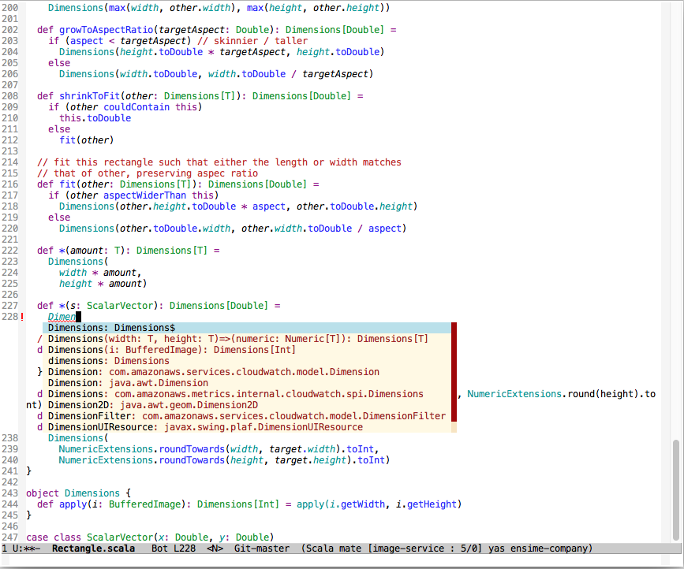
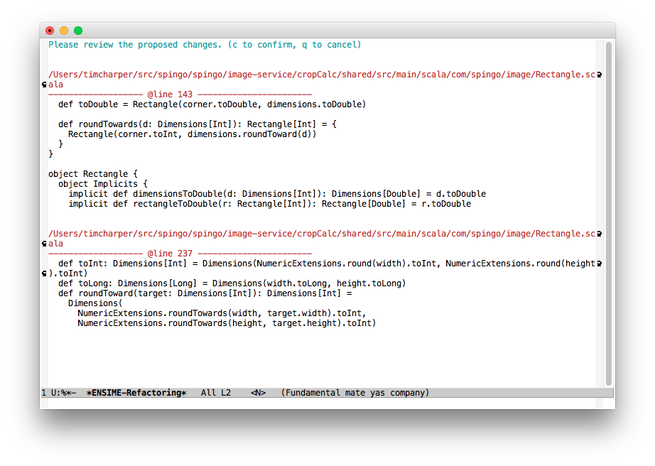

# SpinGo <3 Scala

At SpinGo, we've been building our software on Scala, a staticly-typed, multi-paradigm programming language for the JVM. We've enjoyed it and would like to share our experience.

# Why did we choose Scala?

Two years ago, SpinGo was running entirely PHP on the backend (using the framework CakePHP). The code was incredibly imperative, didn't have a single unit test, and the number of 500+ line methods were less rare than I'd like. As a company, we were playing whack-a-mole with our code; every time we'd change a feature, 3 or 4 things would break. This was an incredible drain to engineering morale: 50% of development effort was spent addressing regressions. We decided, as a company, that we would be better off in the long run picking better tools.

Some of the features we looked for in our next toolset were as follows:

- Functional programming support
- Object-oriented programming support
- Strongly typed (and, specifically, a type system that doesn't get in the way)
- High signal, low noise
- Great community built around rich standard library
- Great dependency management system
- Reasonable amount of inertia
- Open Source
- Bonus: Fast

We'd also felt it was time to switch our paradigm to that of rich-client / API for our applications; so, we also wanted a language which had great library support for writing JSON webservices.

We most deeply considered moving to `Ruby`, `Clojure`, `Go`, `Python`, or `Haskell`. These are all fine choices, and companies have built great software in each of them. In the end, `Scala` stood out as the clear as the language that aligned best with our goals.

# What would you report about your experience with Scala?

## Scala as a language

Overall, we've really enjoyed it. Scala is a tremendously rich language, with features including pattern-matching, monads and monadic operations built-in to the standard-library, for-comprehensions, multiple-inheritance via traits, type-inference, implicits, and many more! Personally, as one coming from predominently Ruby and Clojure, implicits were one of the features that was most novel to me; I didn't appreciate it at first, but it's quickly become one of my favorite features of the language. The collection library is incredibly robust and contains most every collection manipulation method you need (although, no [transducers](http://clojure.org/transducers) here).

Some comments about experience with Scala from other members of our team:

> After I spent a few hours studying Scala I decided I wanted to work in it full time.  A year after I couldn't imagine going back to writing Java. Scala changed the way I look at software problems." - [Jake Wilson](https://github.com/jakewilson801)

> Transitioning from programming in Ruby to Scala has been great. Many of the features I enjoyed in Ruby are available in Scala but with a powerful type sytem, better functional programming support, and it's fast! - [Joe Tanner](https://github.com/jtanner)

> Having developed in Java for the past 15 years, I've found Scala to be a breath of fresh air. Elegant, concise, powerful, expressive. The power of functional programming is something you can't live without once you wrap your head around it. Your code becomes cleaner and more testable, and easier to reason about. And the designers and maintainers of Scala are as nice as they are smart, very willing to answer questions themselves and receive criticism as readily as they do praise. This keeps the language fresh, and progressing instead of stagnant. - [Eric Nelson](https://github.com/enelson)

## Ecosystem?

Typesafe is the Open Source company behind Akka, Spray, Slick, Play, Scala, and others; I am consistently impressed with the amount of thought put behind the entire platform. It's innovative, the products are a pleasure to use and they are really well designed. Further, our experience with Typesafe backed products has been that they are incredibly stable. It's been rare that we've seen a major bug in even their Milestone releases.

The Scala maintainers are extremely active, friendly, and helpful. I had the pleasure of working with them in order to get a fix I'd made to Scala accepted (which, I'm proud to say landed in [2.11.5](http://www.scala-lang.org/news/2.11.5#contributors)! ).

## Tool support

Two years ago, when we began adopting Scala, tool support was a bit of a sore spot. Things have become drastically better since, with 3 solid options for Scala development. In order of our preference:

1. [Ensime / Emacs](https://github.com/ensime/ensime-server/wiki/Quick-Start-Guide) is our favorite Scala environment at SpinGo.
2. Following that, [IntelliJ](https://www.jetbrains.com/idea/features/scala.html) would presently win second place. It works well, but you're forced to wait for the initial indexing process when booting up the editor. My biggest criticism of IntelliJ is it lacks proper Macro support, so you will get a lot of false positives. But, it performs well otherwise, and presently supports specific Scala macros used by popular libraries.
3. [Scala IDE](http://scala-ide.org) is mature and very stable. It has full Macro support and it's code parsing is power by code from the Scala compiler itself. The biggest downside is that it can, at times, become blocked on background tasks.

## What has been your biggest complaints about Scala?

No language or tool is perfect; Scala has some spots that occassionally cause us to feel sad. These are some of lamentations:

- Type inference is complex, it can take a while to understand why in some cases it can infer the type properly, but in others it can't. As an upside, the set of rules for type inference are quite simple once you understand them, and they are applied consistently; it is unlikely that a beginning Scala programmer will grok this aspect of Scala.
- Compiler performance is still on the slow side. To be fair, the compiler is doing a LOT more work for you than the Java compiler. In practice, however, it's been manageable, and improved new incremental compiler that shipped with 2.11 has reduced a lot this pain.
- Type erasure. This is a JVM limitation, and is fundamentally due to the decision of how Java implemented generics. In practice, it's a minor qualm, and is easy enough to work around
- Referencing abstract trait values inside of trait constructor is pitfall. The trait constructor is run before the class which implements it; therefore, if the class initializes a value, then the value will not be available in the trait constructor. It's easy enough to work around it by declaring things as lazy, but it is a bit of a pitfall.

Even with these considered, Scala is a tremendously pleasant environment in which to work. We remain tremendously optimistic about the future of Scala.

# Do you have any favorite libraries?

We really, REALLY enjoy [Play-JSON](https://www.playframework.com/documentation/2.4.x/ScalaJson). Hands down, it is *the* single best JSON serialization library I have ever used. It's functional, it's ridiculously composable, and the way it uses Scala implicits is genius. The library uses no runtime reflection to load data into classes; instead, macros are used to generate readers and writers from your class structure at compile time. This enables concise format declaration with the option of breaking out and having as much control over serialization as you need. Additionally, since format dependencies are resolved at compile time, if you are missing a way to read a string into a Joda DateTime object, you'll find out at compile time, not at run-time.

[Spray](http://spray.io) is also genius level. If you favor composition over inheritance (as we are SpinGo), you'll likely enjoy it. Your routing, header handling, pulling data from form / query string can be concisely expressed using composable, expressive, and declarative directives. It incredibly fast and uses non-blocking IO. Note, Spray itself is being merged into the `Akka` project, as [Akka HTTP](http://doc.akka.io/docs/akka-stream-and-http-experimental/1.0-M2/scala/http/).

[Akka](http://doc.akka.io/docs/akka/2.3.11/scala.html?_ga=1.189539432.2145268044.1421160381) is an excellent implentation of the Actor model. While the actor pattern has it's limitations and can be easily abused, Finite State Machines are wonderful things and Akka supports this pattern marvelously.

[Akka Stream](http://doc.akka.io/docs/akka-stream-and-http-experimental/1.0-RC2/scala.html?_ga=1.189934440.2145268044.1421160381) is a Reactive Streams implementation and provides excellent support for functional stream processing. Reactive Streams is like RX (Reactive Extensions), but all stream components provide a signal for demand, enabling downstream components to slow down message producers in a non-blocking way.

[Slick](http://slick.typesafe.com) is a functional relational database mapper. Queries are written using for-comprehensions, and can be validated by the Scala compiler at compile time. It is highly composable, too; making it easy to reuse partial query logic in a myriad of ways, all while retaining still having your query validated at compile time.

[Op-Rabbit](https://github.com/SpinGo/op-rabbit); okay, shameless plug here. We developed `Op-Rabbit`. It's a high-level, opinionated RabbitMQ toolkit for implementing common message patterns.

# Conclusion

In hindsight, Scala has proven to be a great technology choice. It's backed by a successful, vibrant Open Source company, Typesafe, which also develops and offers paid support for various prominent projects in the Scala community, including Apache Spark. It's feature rich, has a vibrant community, and in our experience the code that we produce generally works on the first try.

If you're looking to move away from Java, take a serious look at Scala. Right now is a great time to adopt it. Tool support has generally arrived, it's a seriously solid option.

